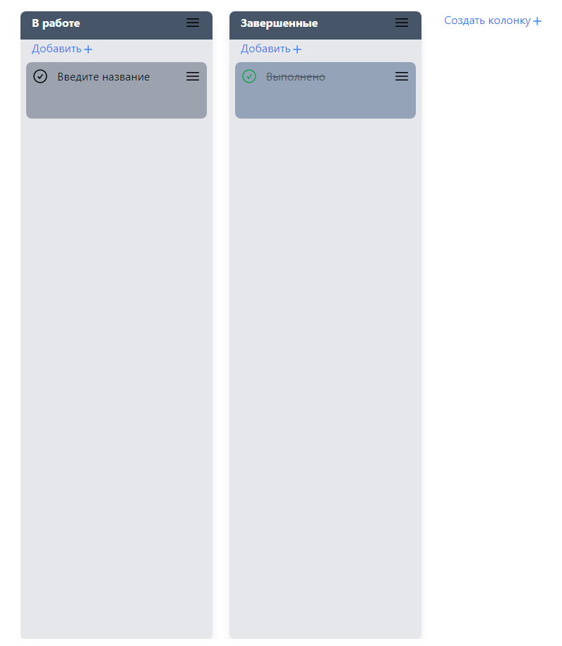

# Todo-app built with Vue 3 Composition Api and Pinia

[Watch here](https://turdiev.github.io/todo-vue-composition-api/)

## Tools

- [Vue CLI](https://cli.vuejs.org/)
- [Typescript](https://www.typescriptlang.org/)
- [Composition Api](https://composition-api.vuejs.org/#summary)
- [Pinia](https://pinia.vuejs.org/introduction.html)
- [vue.draggable.next](https://github.com/SortableJS/vue.draggable.next)
- [Tailwind CSS](https://tailwindcss.com/docs/installation)

## Usage

After installing the dependencies the following NPM scripts become available:

- `serve`: starts the application in development mode on [http://localhost:8080](http://localhost:9000)
- `build`: bundles the application for production into the `dist` folder
- `lint`: lint
